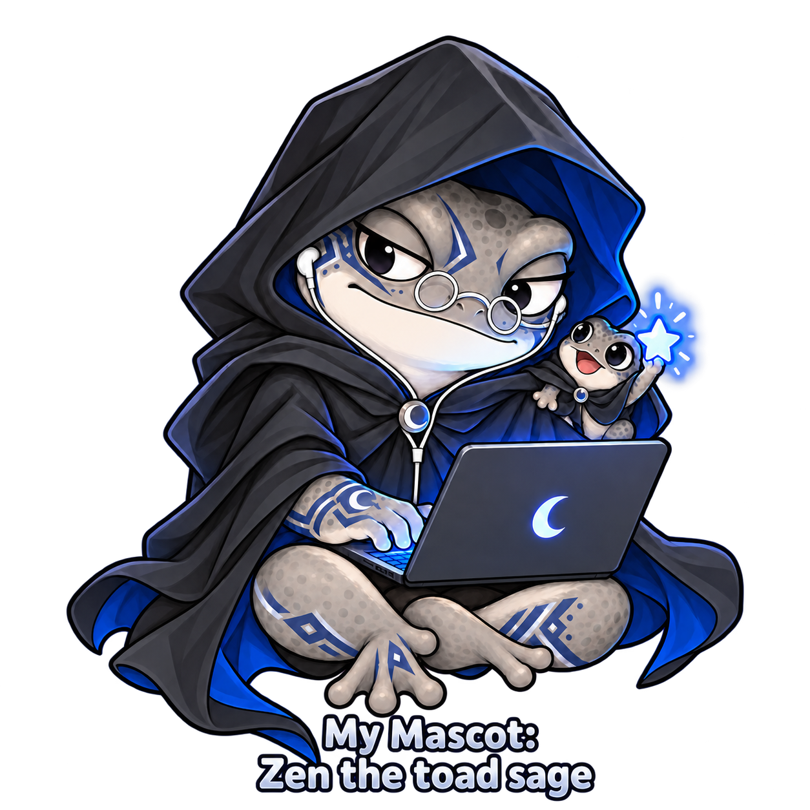

## Hi there, I'm Erick 👋

Just trying to make some cool things on the Internet and be a good human.

- Software Engineer
   - Previously worked @:
     - Casco - https://casco.com/
     - Amazon [SageMaker PySDK](https://aws.amazon.com/blogs/machine-learning/accelerate-your-ml-lifecycle-using-the-new-and-improved-amazon-sagemaker-python-sdk-part-1-modeltrainer/)
- Volunteer Software Developer at [Seattle Digital Commons (SDC)](https://digseattle.org/about/).
- As a side hobby, I help operate the online storefront for our family business, [Alma & Jaime Jewelry](https://www.almajaimejewelry.com/).
- Studied Computer Science at [Georgia Tech](https://www.cc.gatech.edu/)

Want to know more about me? [Check out my portfolio.](https://erickbenitez.com/)

<!--
**ericb336/erickb336** is a ✨ _special_ ✨ repository because its `README.md` (this file) appears on your GitHub profile.

Here are some ideas to get you started:

- 🔭 I’m currently working on ...
- 🌱 I’m currently learning ...
- 👯 I’m looking to collaborate on ...
- 🤔 I’m looking for help with ...
- 💬 Ask me about ...
- 📫 How to reach me: ...
- 😄 Pronouns: ...
- ⚡ Fun fact: ...
-->

 
