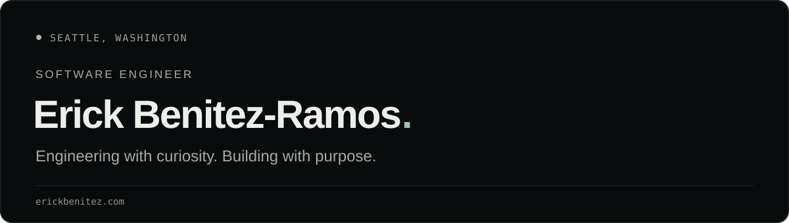

[Portfolio ↗](https://erickbenitez.com/) &nbsp; · &nbsp; [LinkedIn ↗](https://www.linkedin.com/in/erickb336/) &nbsp; · &nbsp; [X ↗](https://x.com/erickb336)

From machine learning infrastructure at **Amazon Web Services** to AI agents for autonomous security at **Casco**. Now building personal tools, contributing to community projects, and growing our family business.

Just trying to make some cool things on the Internet and be a good human.

### `01` &nbsp; Where I’ve been

**Seattle Digital Commons** · Volunteer Software Developer  
Building civic software that helps people explore and understand local government. Contributing to Council Record, an ongoing project focused on accessible, source-backed civic information.  
[Seattle Digital Commons ↗](https://digseattle.org/)

**Casco** · Software Engineer  
Built AI agents that autonomously tested the security of web apps, APIs, infrastructure, and AI systems.  
[Casco ↗](https://casco.com/)

**Amazon Web Services** · SDE II · SDE I · Internships  
Worked on SageMaker training infrastructure, the Python SDK, and Studio. Earlier internships focused on Amazon Transcribe.  
[ModelTrainer launch article ↗](https://aws.amazon.com/blogs/machine-learning/accelerate-your-ml-lifecycle-using-the-new-and-improved-amazon-sagemaker-python-sdk-part-1-modeltrainer/) · [Full experience ↗](https://erickbenitez.com/#experience)

Georgia Tech · Computer Science

### `02` &nbsp; Building & exploring

| Project | What it’s about |
| :--- | :--- |
| [**Orchestrator**](https://github.com/erickb336/orchestration) | A local workspace for coordinating coding agents through planning, implementation, and review. |
| [**Alma & Jaime Jewelry**](https://www.almajaimejewelry.com/) | Bringing our family’s Atlanta jewelry business online and helping it grow into its next chapter. |
| [**More projects ↗**](https://erickbenitez.com/#work) | Developer tools, experiments, and things I’m learning by building. |

### `03` &nbsp; Beyond the work

Runs, walks, and time in the gym. Books, music, and life through my lens.

[Photo journal ↗](https://erickbenitez.com/journal/) &nbsp; · &nbsp; [About & bookshelf ↗](https://erickbenitez.com/about/)

---

### Let’s Connect

Have something interesting in mind? [Find me on LinkedIn ↗](https://www.linkedin.com/in/erickb336/)
